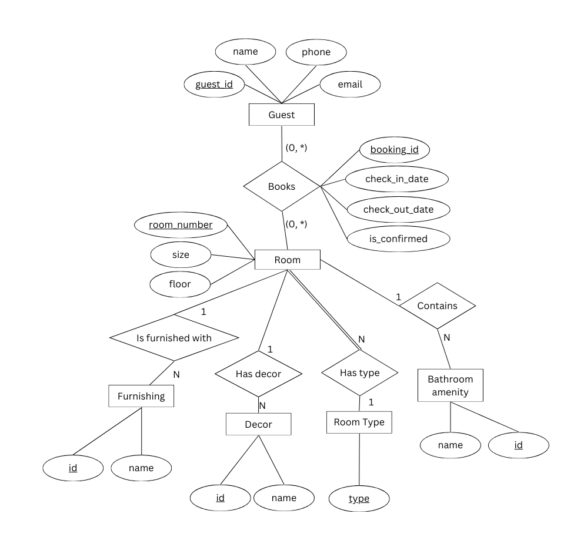

# GWS-SWE-CC4
Take home assignment for SWE Intern (GDS CC4.0).

# Task 1

## Setup
### Executable JAR File
1. Ensure you have Java 11 or above.
2. Download the JAR file from:

    https://github.com/Zer0Legion/GWS-SWE-CC4/releases/tag/v1.0.

3. Navigate to the directory where the JAR file is downloaded using your CLI. On Unix terminals (Git Bash), typing `ls` will show `Balancer.jar`.
4. Run:

    ```java -jar Balancer.jar```.
5. Manually type in the input you want to test and enter a blank line to retrieve the answer (similar to the Word Document examples).
6. For input redirection, you can type the following command: 
    ```
    java -jar Balancer.jar < {name of input file}
    ```
7. The testcases from the Word Document are included under the `docs/test` directory.

### Source Code
1. To view the source code, use Git to clone this repository to your desktop.

## Features and Design Choices
### References
Build-related files like checkstyle and other configuration files were referenced from https://se-education.org/. 
### Use of `HashMap` to store payment mappings
Multiple entries with the same name are now allowed, which adds to the payer's total amount paid in the logic component.
This is to facilitate the flow of a normal trip with friends, where multiple transactions are made by the same people throughout the trip. 
### Allowing negative payment values
This is to account for situations where someone in the group has a windfall that they want to share with the entire group. 
>For example, the ongoing Taiwan lucky draw event where a member of the group may win NT$5000 that they intend to share with the rest of the group.
> The representation for such an input is:
> 
> ```Ali,-5000```
### String parsing
My program assumes that a valid name does not contain any commas in it.

During parsing and returning the answer, my program will parse the name into its appropriate Title Case format:

>`alice` will be displayed as `Alice`
> 
 Thus, `alice` and `Alice` will be recognized as the same person, but `Alice Tan` and `Alice Lim` will not.
>
> `old mcDonald` will be displayed as `Old Mcdonald`

and so on.

### Value parsing
My program will parse any `float` value that Java's `Float.parseFloat` can.

Hence, commas should not be placed in the amount paid.


# Task 2



### Assumptions
- **BOOKS** Relationship captures an instance of a booking. As there may be lull periods where there are completely no bookings with the hotel, 0 or more instances of **GUEST**s and **ROOM**s can participate in this relationship.
- As multiple **BOOKING**s may be made in the real world (overbooking, etc), an additional `is_confirmed` attribute is included to represent the actual hotel stay. However, the constraint of a **ROOM** having 1 confirmed stay at a time will be left to the SQL code to enforce.
- Each instance of **FURNISHING**, **DECOR** and **BATHROOM AMENITY** due to their physical nature can only be in 1 **ROOM** at a time, and hence they all have a 1 to N cardinality constraint with **ROOM**. They also can be in storage and thus do not have mandatory participation.
- On the other hand, **TYPE** is abstract and thus 1 instance of it can participate in the relationship with multiple **ROOM** instances.
- Each **ROOM** must have a **TYPE** which forces the mandatory participation.

## Thank you for your consideration.